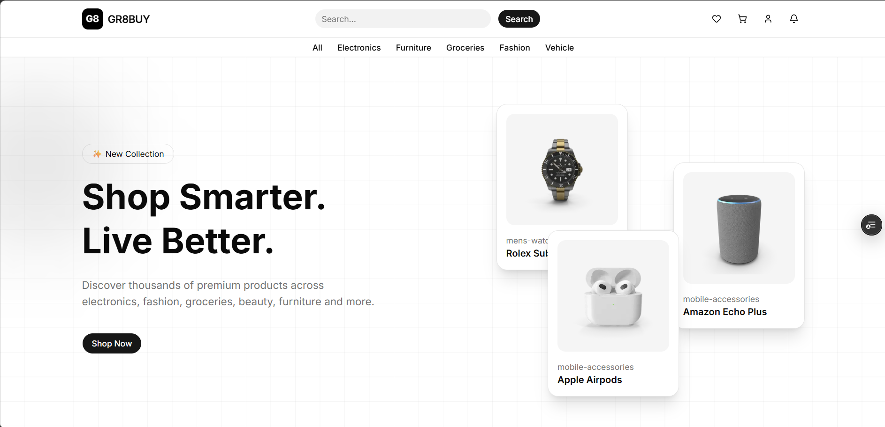
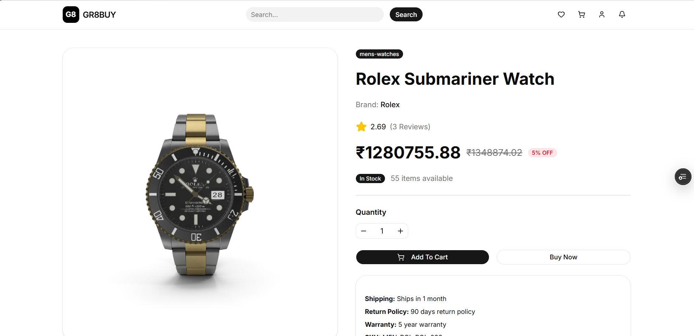
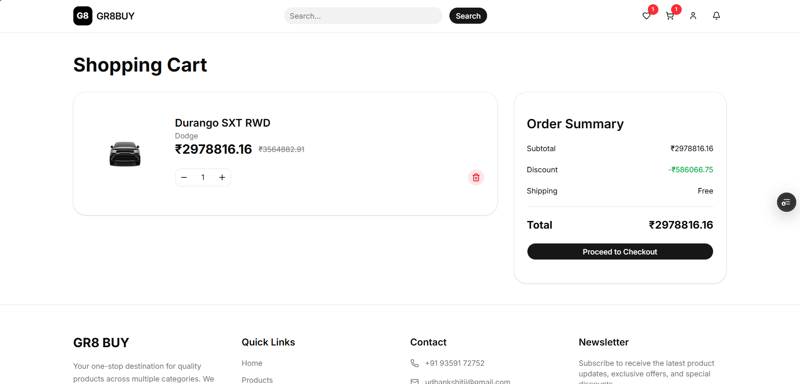
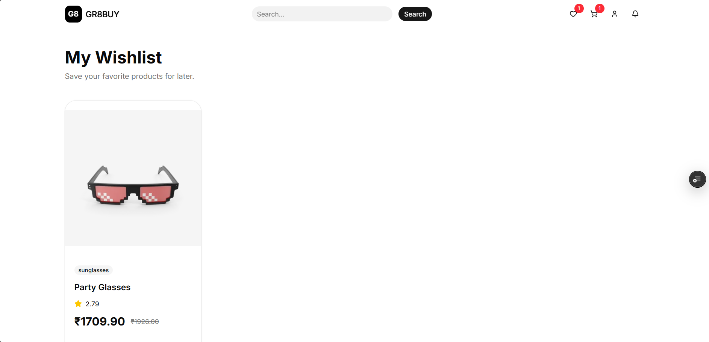

# 🛍️ GR8BUY

GR8BUY is a modern e-commerce web application built with **React**, **Redux Toolkit**, **Vite**, **Tailwind CSS**, and **shadcn/ui**. It provides a clean shopping experience with product browsing, search, category filtering, wishlist management, shopping cart functionality, pagination, currency conversion, and responsive design.

---

## 🚀 Live Demo
```
(https://gr8-buy.vercel.app/)
```

---

## 📸 Screenshots

| Home                            | Product Details                       |
| ------------------------------- | ------------------------------------- |
|  |  |

| Cart                            | Wishlist                                |
| ------------------------------- | --------------------------------------- |
|  |  |

---

# ✨ Features

### 🛒 Shopping

* Browse all products
* Product detail page
* Dynamic stock availability
* Quantity selection
* Add to Cart
* Shopping cart management
* Order summary

### ❤️ Wishlist

* Add products to wishlist
* Remove from wishlist
* Wishlist badge in header

### 🔍 Search & Filter

* Search products by title
* Filter products by category
* Combined filtering and searching

### 📄 Pagination

* Client-side pagination
* Automatic page reset on filter/search changes

### 💱 Currency Conversion

* Real-time currency conversion to INR
* Discounted price calculation

### 🔔 Notifications

* Toast notifications using Sonner
* Success and information messages

### ⚡ Performance

* Memoized product filtering
* Skeleton loading UI
* Derived state using `useMemo`
* Reusable utility functions

### 🎨 UI

* Responsive layout
* Modern card-based design
* Loading skeletons
* Empty states
* Error handling
* Dynamic page titles and favicon

---

# 🛠️ Tech Stack

### Frontend

* React 19
* React Router DOM
* Redux Toolkit
* React Redux

### Styling

* Tailwind CSS
* shadcn/ui
* Lucide React

### Utilities

* React Helmet Async
* React Hash Link

### Build Tool

* Vite

### API

* DummyJSON Products API
* ExchangeRate API (Currency Conversion)

---

# 📁 Project Structure

```text
src
├── assets
├── components
│   ├── Banner
│   ├── Cart
│   ├── Categories
│   ├── Footer
│   ├── Header
│   ├── Home
│   ├── Product
│   ├── Wishlist
│   ├── ui
│   └── utilities
├── hooks
├── pages
├── redux
├── routes
└── main.jsx
```

---

# 🧠 Concepts Practiced

* React Functional Components
* React Hooks
* Custom Hooks
* React Router
* Redux Toolkit
* Redux Middleware
* Derived State
* Component Composition
* Memoization with `useMemo`
* API Integration
* Local Storage Persistence
* Responsive Design
* Utility Functions
* Error Handling
* Loading Skeletons

---

# 📌 Future Improvements

* Product sorting
* User authentication
* Checkout flow
* Payment integration
* Product reviews
* Dark mode
* Product recommendations

---

# 👨‍💻 Author

**Kshitij Udhan**

GitHub: https://github.com/kshitijudhan

LinkedIn: https://linkedin.com/in/kshitij-udhan

---

# 📄 License

This project is created for learning and portfolio purposes.
